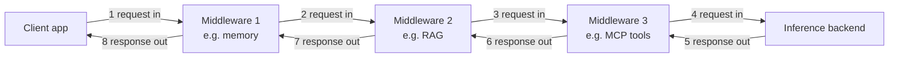
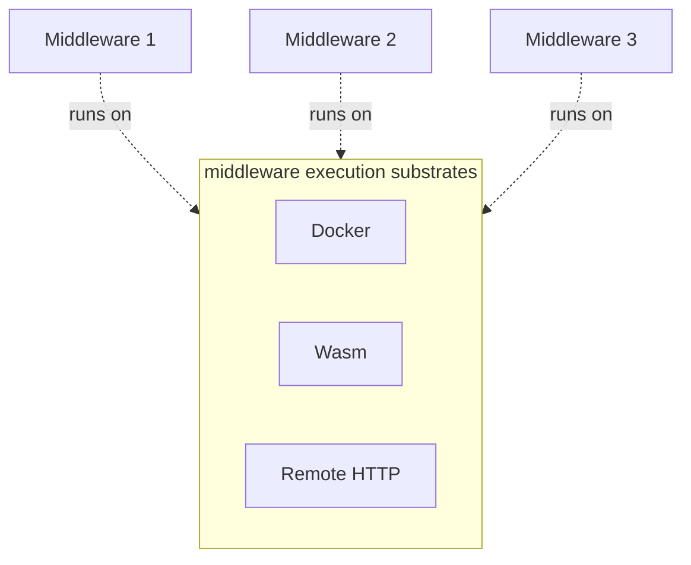
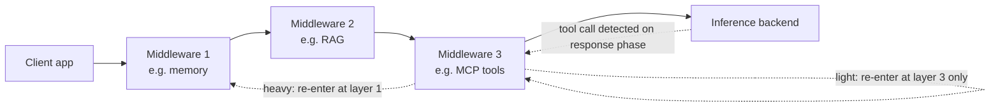

# ai-chassis — Design Spec

> **Status: pre-code.** Everything in this document is a proposal, not a
> description of an implementation. No engine, no middleware runtime, no
> config schema, no API exists yet. Names, shapes, and decisions below are
> starting points for iteration, not commitments — see [Philosophy](#philosophy).

## 1. Problem

The AI tooling ecosystem treats the LLM call as "the product." Everything
that actually makes an AI system useful — retrieval/RAG, tool orchestration
(MCP), plugin/extension management, memory — gets treated as peripheral
infrastructure bolted onto whichever layer happens to own the user-facing
surface. Today that's usually the chat UI (e.g. Open WebUI). This holds even
at single-user, hobbyist scale, not just in enterprise deployments.

Anyone who has used both a frontier AI product (Claude, ChatGPT, etc.) and a
self-hosted local LLM setup can see the fallacy here: frontier products are
obviously *not* just an LLM API with a chat window on top. They're a
coherent system — routing, memory, tool use, retrieval, and orchestration
logic all designed together. Self-hosted setups rarely have an equivalent,
because there's no reference architecture that treats "a complete AI
system" as a first-class thing to define.

Existing gateway products — Bifrost, Kong AI Gateway, Portkey, TrueFoundry —
solve a real but narrower problem: multi-provider routing, failover,
latency, observability, and governance across LLM calls and MCP tool
invocations. They operate *underneath* the system, not *as* the system. None
of them ask "what is the declarative shape of an entire AI product?" the way
a web framework asks "what is the declarative shape of a web app?" (routes +
auth + persistence + templating, understood as one coherent unit, not four
unrelated libraries a developer happens to wire together).

## 2. What ai-chassis is trying to be

ai-chassis is a **middleware engine that defines complete AI systems as a
single portable artifact**, not another LLM gateway and not an inference
runtime.

It does not run inference itself. An end-user application calls ai-chassis'
API instead of calling an LLM provider directly. ai-chassis runs that
request through a configurable pipeline of middleware (RAG, memory, tool
orchestration, etc.), then forwards the resulting, modified request to an
actual inference backend (Ollama, vLLM, or a third-party provider) and
returns the result.

The unit of value is not "a faster/cheaper LLM call." It's **the assembled
system**: which middleware runs, in what order, configured how, talking to
which backend. That assembly should be something you can name, version,
export, hand to someone else, and re-import — the same way a `docker-compose.yml`
or a web framework's route table is a portable description of a running
system, not just config for a single component.

### What it explicitly is not

- Not an inference server. It calls out to one (Ollama, vLLM, hosted APIs).
- Not primarily a multi-provider router/failover tool. Provider routing may
  fall naturally out of the backend-connection concept, but it's a
  secondary concern, not the reason this exists.
- Not a chat UI. It's the layer a chat UI (or any other client) would sit on
  top of.
- Not, at this stage, a claim about which execution substrate, config
  format details, or API shape are correct — those are open questions this
  doc frames but does not close.

## 3. Core concepts

### 3.1 System definition = the TOML config

The V1 deliverable is an engine that can **export and import an entire AI
system definition as a single TOML file.** The config file is not "settings
for the engine" — it *is* the portable definition of the system: which
middleware are wired in, their order, their individual configuration, and
which inference backend(s) the assembled pipeline calls.

This gives the project a concrete, testable definition of done for V1: take
a running system, make sure it can forward a conversation correctly, export 
its config, hand the file to someone else (or another instance), import it,
and get the same system back, complete with the same behavior for the same
tests.

### 3.2 Middleware are external processes, not library code

Individual capabilities — RAG, MCP tool orchestration, memory, future
capabilities not yet imagined — are **not** implemented as logic baked into
the engine's own codebase. Each one runs as a separate process that the
engine orchestrates. The engine's job is invocation and pipeline
composition, not implementing every capability itself.

Rationale: this is what makes "export a system as a config file" meaningful
rather than cosmetic. If capabilities were compiled-in engine code, the
config would just be feature flags. Because they're external processes, the
config is genuinely describing *which independently-developed pieces* make
up this system — closer to how a docker-compose file names images than how
a settings file names booleans.

Candidate execution substrates for those processes (not yet committed to
one):

- **Docker containers** — mature, well-understood isolation, heavyweight.
- **Wasm runtimes** — lightweight, fast startup, sandboxed, less mature
  ecosystem for arbitrary middleware logic.
- **Remote HTTP servers** — no isolation story of its own (relies on
  network boundaries), simplest to integrate, easiest to reuse existing
  services as middleware.

The engine may end up supporting more than one substrate rather than
picking a single one — see the open problem below.

### 3.3 Invocation contract: two-pass, onion-shaped
Middleware isn't a one-way pipe from client to backend. It's **two passes
through the same ordered stack — an onion, not a conveyor belt.** A request
passes inward through each middleware layer on its way to the model; the
response passes back outward through the same layers, in reverse order, on
its way to the client. Each middleware gets (up to) two hooks, not one: a
request-phase hook and a response-phase hook.

This allows stateful and stateless middleware equally well. A middleware that 
needs state across the round trip — memory being the clearest case, but also 
e.g. token-budget tracking, or an MCP tool call whose result needs to be woven
into the eventual response — stashes whatever it needs when it sees the request
on the way in, and picks it back up when that same invocation's response
passes back through on the way out. Purely stateless middleware (e.g. a RAG 
lookup that only ever touches the request, never the response) simply doesn't
implement the response-phase hook, or implements it as a passthrough.

Same three middleware, two passes: request phase runs 1→2→3 (client toward
backend), response phase runs the *same stack in reverse*, 3→2→1 (backend
back toward client) — mirrored order, the same guarantee every web
middleware framework makes.

What this reframes, rather than resolves:

- **Correlation across the two passes.** Because middleware run as separate
  external processes (§3.2), not in-process objects that can just close
  over local state, a middleware instance needs some way to recognize "this
  response-phase call is the other half of that request-phase call I saw
  earlier" — a request/invocation ID the engine threads through both calls,
  at minimum. This matters more for substrates with no guaranteed process
  affinity (e.g. HTTP middleware behind a load balancer) than for a
  long-lived container that can just hold the state in memory.
- **Streaming responses.** A response-phase pass that runs once, after the
  full response is available, is straightforward but kills token-by-token
  streaming to the client. A pass that runs per-chunk is streaming-friendly
  but means "the response" a middleware sees on the way out is partial,
  which is a much harder thing for a middleware to reason about or mutate
  correctly.
- **Substrate-level shape of the contract** — HTTP-uniform interface vs. a
  transport-independent schema with per-substrate adapters (per §3.2) —
  which is a separate question from the two-pass shape itself: the onion
  model says *what* the contract needs to express (a request phase and a
  response phase, correlated), not *how* each substrate physically carries
  that.
- **Control flow implementation.** Recursion (for tools) and short-circuiting
  (for caching and rate-limiting) will have to be available to middleware.
  How the signaling works for those two cases while staying inside the
  onion-style layering principle is a detail that will have to be evaluated.

This contract is arguably the most architecturally important unresolved
piece of the whole project, since it determines how much freedom exists on
the substrate question later.

### 3.4 Request flow (illustrative, not final)

The stack in §3.3's diagram is what the TOML file describes: an ordered
list of middleware, each backed by one of the candidate execution
substrates.

Each middleware's substrate, config, and position in the stack are what the
TOML file records. The stack shown is linear for simplicity; whether the
real model is strictly linear, a DAG, or allows branching/short-circuiting
is part of the open invocation-contract question above.

### 3.5 Recursion: how much of the stack re-runs?

§3.3 covers a single round trip: one request phase in, one response phase
out. That's not enough for agentic behavior. When MCP tool orchestration
middleware sees, on the response phase, that the model wants to call a
tool, "transform the response and keep unwinding" isn't the right move —
the tool needs to run, its result needs to go back to the model, and the
model needs another turn before anything is ready to return to the client.
That's the response phase deciding a new request phase has to happen,
mid-unwind, without a new inbound client request driving it.

So the invocation contract needs recursion triggerable from **both** sides:
the normal case (client → request phase → backend) and this case (a
middleware's response-phase hook → another request phase → backend again).
Web middleware frameworks don't usually need the second kind — an Express
or Koa response-phase handler doesn't get to say "hold on, re-invoke the
handler before you finish unwinding." Here, it has to.

Once a middleware can trigger that, there's a real cost/consistency
trade-off in how much of the stack re-runs:

- **Heavy recursion.** A triggered loop re-enters at the *top* of the
  stack, exactly like a fresh top-level request — layer 1 through the
  backend and back out again, every time. Every layer gets a simple,
  uniform guarantee: "whatever loop iteration this is, I see the full
  current state of the turn, handled the same way I'd handle any request."
  Costly if it means memory lookup or RAG retrieval — work that's already
  done for this logical turn — re-runs on every tool-call round trip.
- **Light recursion.** A triggered loop re-enters only at (or below) the
  layer that triggered it — outer layers that already did their job for
  this turn are skipped on the loop. Cheaper, but the engine now has to
  track *where* in the stack a given loop re-enters, and outer middleware
  that never sees the intermediate loops has to trust that skipping them
  was fine — a much weaker guarantee than "I always see every pass."

Neither option is picked yet. This also isn't independent of the other
open items in §3.3 — it makes them sharper:

- **Correlation.** If light recursion means outer middleware only see part
  of a multi-loop turn, "which invocation is this the other half of"
  (§3.3) has to mean "which *turn*," not just "which single request/response
  pair" — a turn may now span several request/response pairs.
- **Streaming.** Does the client see intermediate tool-call turns at all,
  or only the final answer once the loop resolves (§3.3)?
- **Termination.** Nothing here yet decides how a loop stops — max
  iterations, a timeout, or a middleware itself declining to loop again are
  all plausible and none is chosen.

## 4. V1 scope

**In scope for V1:**

- A middleware engine process that can load a system definition from TOML
  and assemble the corresponding pipeline.
- Export of a running/loaded system's definition back out to TOML.
- At least one working execution substrate for middleware (not necessarily
  all three candidates) so the pipeline concept is real, not theoretical.
- At least one inference backend connection (e.g. Ollama) so a request can
  flow end-to-end: client → engine → middleware → backend → client.
- An API surface client applications call instead of calling an LLM
  provider directly.

**Explicitly out of scope for V1** (may come later, not blocking the first
deliverable):

- Multi-provider routing/failover as a polished feature. Not useful for
  early prototypes, easy to implement in middleware.
- A plugin marketplace or ecosystem of pre-built middleware. Important, but
  needs the concept proven before it's worth building.
- Support for every candidate substrate simultaneously. Easy enough to add
  later.
- A UI. V1 is API/config-level only. Important, doesn't prove the concept.

## 5. Philosophy

Favor fast iteration over up-front architectural certainty. It's unknown
whether this category of software provides any value at all. So prove the
cheapest version of the concept possible, measure its value, and if the
idea is worth iterating on, do so in ways that are cheap and high-value.

Practical implication: nothing in this document should be read as locked
in. Sections 3.3 and 4 in particular are expected to change once there's
code to react to. This document exists to give iteration a shared starting
point and shared vocabulary, not to prevent iteration from changing course.

## 6. Relationship to adjacent tools

LLM gateways (Bifrost, Kong AI Gateway, Portkey, TrueFoundry) and
ai-chassis solve different problems. Gateways answer "how do I route,
observe, and govern calls across multiple LLM providers and MCP tools."
ai-chassis is trying to answer a layer up: "what is the declarative,
portable shape of an AI system as a whole, of which an LLM call is one
part." A gateway could plausibly sit *underneath* an ai-chassis backend
connection as an implementation detail (e.g., the thing ai-chassis calls
when it forwards a request to "the inference backend" could itself be a
gateway doing provider routing). That composition is speculative, not
designed yet.

Harnesses for coding agents duplicate functionality, and this is acceptable;
the functionality and tools you setup in ai-chassis are expected to generalize
across different user-facing surfaces, while MCPs set up in a coding agent
probably do not generalize outside of coding.

Chat UIs may choose to be a minimal skin over ai-chassis, or may choose to
duplicate functionality from ai-chassis, or may choose to manage ai-chassis
itself. There are use cases for each path, and it is not the job of
ai-chassis to go out of its way to make any of those paths harder.

MCP gateways are great for the problems they do solve, but the box they
paint themselves into prevents them from having the same power an MCP
calling middleware could have.

## 7. Open questions (tracking)

- What does the invocation contract for middleware actually look like at
  the substrate level (HTTP-uniform interface vs. schema + per-substrate
  adapters)? (§3.3 — the biggest open item; the two-pass *shape* of the
  contract is settled, the wire-level details are not.)
- How is a middleware's response-phase call correlated with its own earlier
  request-phase call when the two happen as separate invocations of a
  separate external process? (§3.3)
- How does middleware signal its lack of participation in a hook event?
- How does the response phase interact with streaming responses — does it
  run once on the full response (simple, kills streaming) or per-chunk
  (streaming-friendly, harder for middleware to reason about)?
- Is the middleware pipeline linear, a DAG, or something that allows
  short-circuiting / fan-out — and how does short-circuiting interact with
  a response phase that expects to walk back out through the stack it
  entered?
- Heavy vs. light recursion for middleware-triggered loops (§3.5): does a
  loop re-enter the whole stack from the top, or only the layer that
  triggered it and everything inward of it — and how does the engine track
  where "re-entry" starts for the light case?
- How does a middleware-triggered loop terminate — max iterations, a
  timeout, a middleware declining to loop again, some combination? (§3.5)
- Which single substrate (if any) should V1 target first — Docker, Wasm, or
  HTTP — given each has a different cost to stand up a first working
  example?
- What does the TOML schema actually need to express to be a *complete*
  system definition (middleware graph + config + backend connection), and
  what's the minimum viable version of that for V1?
