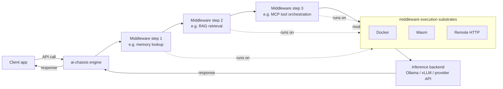

# ai-chassis — Design Spec

> **Status: pre-code.** Everything in this document is a proposal, not a
> description of an implementation. No engine, no middleware runtime, no
> config schema, no API exists yet. Names, shapes, and decisions below are
> starting points for iteration, not commitments — see [Philosophy](#philosophy).

## 1. Problem

The AI tooling ecosystem treats the LLM call as "the product." Everything
that actually makes an AI system useful — retrieval/RAG, tool orchestration
(MCP), plugin/extension management, memory — gets treated as peripheral
infrastructure bolted onto whichever layer happens to own the user-facing
surface. Today that's usually the chat UI (e.g. Open WebUI). This holds even
at single-user, hobbyist scale, not just in enterprise deployments.

Anyone who has used both a frontier AI product (Claude, ChatGPT, etc.) and a
self-hosted local LLM setup can see the fallacy here: frontier products are
obviously *not* just an LLM API with a chat window on top. They're a
coherent system — routing, memory, tool use, retrieval, and orchestration
logic all designed together. Self-hosted setups rarely have an equivalent,
because there's no reference architecture that treats "a complete AI
system" as a first-class thing to define.

Existing gateway products — Bifrost, Kong AI Gateway, Portkey, TrueFoundry —
solve a real but narrower problem: multi-provider routing, failover,
latency, observability, and governance across LLM calls and MCP tool
invocations. They operate *underneath* the system, not *as* the system. None
of them ask "what is the declarative shape of an entire AI product?" the way
a web framework asks "what is the declarative shape of a web app?" (routes +
auth + persistence + templating, understood as one coherent unit, not four
unrelated libraries a developer happens to wire together).

## 2. What ai-chassis is trying to be

ai-chassis is a **middleware engine that defines complete AI systems as a
single portable artifact**, not another LLM gateway and not an inference
runtime.

It does not run inference itself. An end-user application calls ai-chassis'
API instead of calling an LLM provider directly. ai-chassis runs that
request through a configurable pipeline of middleware (RAG, memory, tool
orchestration, etc.), then forwards the resulting, modified request to an
actual inference backend (Ollama, vLLM, or a third-party provider) and
returns the result.

The unit of value is not "a faster/cheaper LLM call." It's **the assembled
system**: which middleware runs, in what order, configured how, talking to
which backend. That assembly should be something you can name, version,
export, hand to someone else, and re-import — the same way a `docker-compose.yml`
or a web framework's route table is a portable description of a running
system, not just config for a single component.

### What it explicitly is not

- Not an inference server. It calls out to one (Ollama, vLLM, hosted APIs).
- Not primarily a multi-provider router/failover tool. Provider routing may
  fall naturally out of the backend-connection concept, but it's a
  secondary concern, not the reason this exists.
- Not a chat UI. It's the layer a chat UI (or any other client) would sit on
  top of.
- Not, at this stage, a claim about which execution substrate, config
  format details, or API shape are correct — those are open questions this
  doc frames but does not close.

## 3. Core concepts

### 3.1 System definition = the TOML config

The V1 deliverable is an engine that can **export and import an entire AI
system definition as a single TOML file.** The config file is not "settings
for the engine" — it *is* the portable definition of the system: which
middleware are wired in, their order, their individual configuration, and
which inference backend(s) the assembled pipeline calls.

This gives the project a concrete, testable definition of done for V1: take
a running system, export its config, hand the file to someone else (or
another instance), import it, and get the same system back.

### 3.2 Middleware are external processes, not library code

Individual capabilities — RAG, MCP tool orchestration, memory, future
capabilities not yet imagined — are **not** implemented as logic baked into
the engine's own codebase. Each one runs as a separate process that the
engine orchestrates. The engine's job is invocation and pipeline
composition, not implementing every capability itself.

Rationale: this is what makes "export a system as a config file" meaningful
rather than cosmetic. If capabilities were compiled-in engine code, the
config would just be feature flags. Because they're external processes, the
config is genuinely describing *which independently-developed pieces* make
up this system — closer to how a docker-compose file names images than how
a settings file names booleans.

Candidate execution substrates for those processes (not yet committed to
one):

- **Docker containers** — mature, well-understood isolation, heavyweight.
- **Wasm runtimes** — lightweight, fast startup, sandboxed, less mature
  ecosystem for arbitrary middleware logic.
- **Remote HTTP servers** — no isolation story of its own (relies on
  network boundaries), simplest to integrate, easiest to reuse existing
  services as middleware.

The engine may end up supporting more than one substrate rather than
picking a single one — see the open problem below.

### 3.3 Invocation contract (open design problem)

If Docker, Wasm, and HTTP middleware all need to be interchangeable from
the engine's point of view — i.e., the pipeline shouldn't care *how* a given
middleware step is deployed — there needs to be a **common invocation
contract**: a substrate-independent shape for "call this middleware with
this request context, get back this result (or a mutated request, or a
decision to short-circuit, etc.)."

This is unresolved. Candidate shapes to explore (not decided):

- A fixed HTTP-shaped contract that all substrates present uniformly (Docker
  and Wasm middleware would each need an adapter that exposes this
  interface even if the underlying transport differs).
- A schema for request/response envelopes independent of transport, with
  substrate-specific adapters in the engine responsible for getting bytes
  in and out.
- Whether middleware is limited to "transform the request" / "transform the
  response," or can also do things like short-circuit the pipeline, fan out
  to multiple backends, or maintain state across calls (memory middleware
  almost certainly needs this).

This contract is arguably the most architecturally important unresolved
piece of the whole project, since it determines how much freedom exists on
the substrate question later.

### 3.4 Request flow (illustrative, not final)

Each middleware step, its order, and its config are what the TOML file
describes. The diagram shows a linear pipeline for simplicity; whether the
real model is strictly linear, a DAG, or allows branching/short-circuiting
is part of the open invocation-contract question above.

## 4. V1 scope

**In scope for V1:**

- A middleware engine process that can load a system definition from TOML
  and assemble the corresponding pipeline.
- Export of a running/loaded system's definition back out to TOML.
- At least one working execution substrate for middleware (not necessarily
  all three candidates) so the pipeline concept is real, not theoretical.
- At least one inference backend connection (e.g. Ollama) so a request can
  flow end-to-end: client → engine → middleware → backend → client.
- An API surface client applications call instead of calling an LLM
  provider directly.

**Explicitly out of scope for V1** (may come later, not blocking the first
deliverable):

- Multi-provider routing/failover as a polished feature.
- A plugin marketplace or ecosystem of pre-built middleware.
- Support for every candidate substrate simultaneously.
- A UI. V1 is API/config-level only.

## 5. Philosophy

Favor fast iteration over up-front architectural certainty. The plan is to
use Claude Code to scaffold and rebuild quickly rather than trying to fully
resolve open questions (substrate choice, invocation contract shape, config
schema details) on paper first. The working assumption is that real usage —
actually building a middleware, actually wiring a pipeline, actually
exporting and re-importing a config — will surface bad assumptions faster
and more reliably than more up-front design thinking would.

Practical implication: nothing in this document should be read as locked
in. Sections 3.3 and 4 in particular are expected to change once there's
code to react to. This document exists to give iteration a shared starting
point and shared vocabulary, not to prevent iteration from changing course.

## 6. Relationship to adjacent tools

LLM gateways (Bifrost, Kong AI Gateway, Portkey, TrueFoundry) and
ai-chassis are adjacent, not competing. Gateways answer "how do I route,
observe, and govern calls across multiple LLM providers and MCP tools."
ai-chassis is trying to answer a layer up: "what is the declarative,
portable shape of an AI system as a whole, of which an LLM call is one
part." A gateway could plausibly sit *underneath* an ai-chassis backend
connection as an implementation detail (e.g., the thing ai-chassis calls
when it forwards a request to "the inference backend" could itself be a
gateway doing provider routing). That composition is speculative, not
designed yet.

## 7. Open questions (tracking)

- What does the invocation contract for middleware actually look like?
  (§3.3 — the biggest open item.)
- Is the middleware pipeline linear, a DAG, or something that allows
  short-circuiting / fan-out?
- How does stateful middleware (memory, in particular) fit a model that's
  otherwise "transform a request as it passes through"?
- Which single substrate (if any) should V1 target first — Docker, Wasm, or
  HTTP — given each has a different cost to stand up a first working
  example?
- What does the TOML schema actually need to express to be a *complete*
  system definition (middleware graph + config + backend connection), and
  what's the minimum viable version of that for V1?
- Implementation language/runtime for the engine itself is not yet decided
  in writing anywhere in this doc, though repo scaffolding currently
  suggests Rust is the leading candidate.
